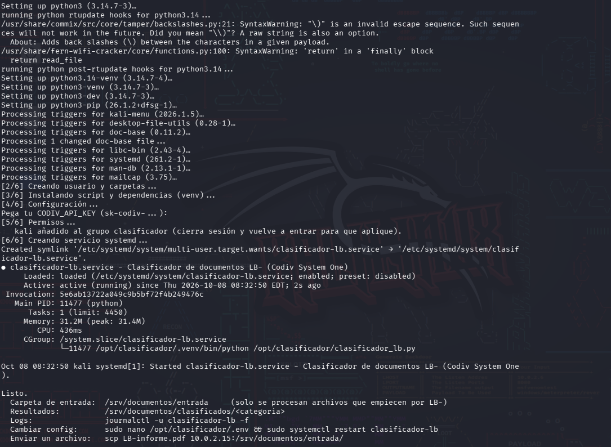
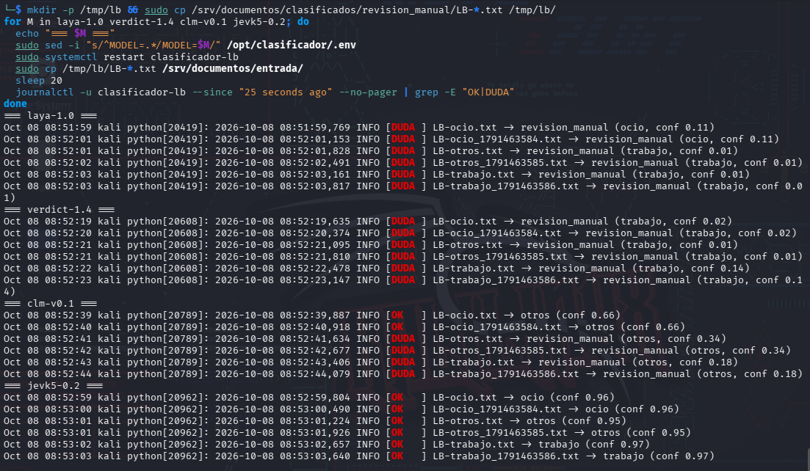
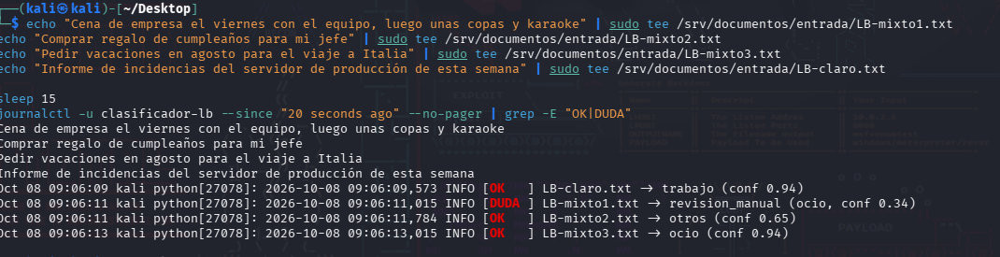

<p align="center">
  
</p>

<h1 align="center">Librarian</h1>

<p align="center"><strong>LB- document classifier</strong> powered by Codiv System One models</p>

**Libraria** is a small service: drop a document whose name starts with `LB-` into a folder and it is classified automatically as **work**, **leisure** or **other** by a [Codiv](https://codiv.ai) *System One* model, then moved to the matching folder. Anything the model is not sure about goes to a manual-review folder instead of being guessed.

It runs as a small Python service (systemd on Kali/Debian/Ubuntu) and can be fed remotely over SSH/SCP.

```
input/LB-report.pdf ──► extract text ──► Codiv System One ──► category + confidence
                                                                     │
                                 confidence ≥ threshold ─────────────┼──► output/work/
                                 confidence <  threshold ────────────┴──► output/manual_review/

input/notes.txt  (no LB- prefix)  ──►  ignored, left untouched
```

## What are System One models?

Instead of generating text, a System One model receives a text and a set of **typed questions** (yes/no, pick one option, score on a scale) and answers them in a single pass, returning a **probability for every option**. That makes them fast, cheap, and easy to automate: the output always fits your schema and there is nothing to parse.

This project asks one question, *"What kind of content is this?"*, with three options (`work`, `leisure`, `other`) and acts on the answer.

## Features

- Only files starting with `LB-` (case-insensitive) trigger processing; everything else is ignored.
- Reads `.txt .md .eml .log .csv .json`, plus `.pdf` (pypdf) and `.docx` (python-docx).
- Confidence threshold with a manual-review folder for uncertain results.
- Waits until a file stops changing before reading it, so half-copied uploads are not processed.
- Retries when the API is busy (HTTP 429/5xx) and leaves the file in place if the API is unreachable.
- Every decision is appended to `registry.csv` (date, file, category, confidence, destination).
- Categories and descriptions are configurable through a JSON file.
- systemd service with basic hardening (`NoNewPrivileges`, `ProtectSystem=strict`, dedicated user).

## Requirements

- Python 3.9+
- A Codiv API key (sign up at [codiv.ai](https://codiv.ai))
- Network access to `api.codiv.ai` over HTTPS
- For the service installer: Debian-based Linux with systemd (tested target: Kali Linux)

## Quick start (Kali / Debian / Ubuntu)

```bash
git clone https://github.com/<your-user>/Libraria.git
cd Libraria
chmod +x install_kali.sh
sudo ./install_kali.sh
```

The installer asks for your API key once, then:

1. installs Python and `venv`,
2. creates a dedicated `lb-classifier` system user,
3. installs the script and its dependencies in `/opt/lb-classifier/.venv`,
4. stores the configuration in `/opt/lb-classifier/.env` (mode 600),
5. creates `/srv/documents/input` and `/srv/documents/output`,
6. creates, enables and starts the `lb-classifier` systemd service.

Log out and back in afterwards so your user picks up the `lb-classifier` group (needed to drop files into the input folder).



### Run it manually (any OS)

```bash
pip install -r requirements.txt

# Linux / macOS
export CODIV_API_KEY="sk-codiv-..."
export INPUT_DIR=./input OUTPUT_DIR=./output
python lb_classifier.py            # keep watching
python lb_classifier.py --once     # process what is there and exit
```

```powershell
# Windows PowerShell
$env:CODIV_API_KEY = "sk-codiv-..."
$env:INPUT_DIR = ".\input"; $env:OUTPUT_DIR = ".\output"
python lb_classifier.py
```

## Configuration

All settings are environment variables (the installer writes them to `/opt/lb-classifier/.env`).

| Variable | Default | Description |
|---|---|---|
| `CODIV_API_KEY` | – | **Required.** Your Codiv API key. |
| `INPUT_DIR` | `./input` | Folder to watch. |
| `OUTPUT_DIR` | `./output` | Where results, `manual_review/`, `errors/` and `registry.csv` go. |
| `PREFIX` | `LB-` | Filename prefix that triggers classification (case-insensitive). |
| `MODEL` | `jevk5-0.2` | `jevk5-0.2`, `laya-1.0`, `verdict-1.4` or `clm-v0.1` (text-only models). |
| `CONFIDENCE_THRESHOLD` | `0.5` | Below this, the file goes to `manual_review/`. |
| `POLL_INTERVAL` | `5` | Seconds between folder scans. |
| `MAX_CHARS` | `8000` | Maximum characters of each document sent to the model. |
| `CATEGORIES_FILE` | built-in | Path to a JSON file with your own categories. |

After editing the `.env`, restart the service:

```bash
sudo nano /opt/lb-classifier/.env
sudo systemctl restart lb-classifier
```

### Custom categories

Copy `categories.example.json`, edit it, and point `CATEGORIES_FILE` to it. Keys become folder names; values are the descriptions the model sees. Short, concrete, non-overlapping descriptions work best.

```json
{
  "work": "Professional content: meetings, reports, clients, projects, company invoices, incidents, work tasks",
  "leisure": "Free time: TV shows, movies, games, travel, sports, hobbies, plans with friends or family",
  "other": "Anything that is clearly neither work nor leisure: personal errands, shopping, bills, loose notes"
}
```

If you change the categories, also adjust the labels in `test_models.py` (or the accuracy summary will not mean anything).

## Choosing a model

`test_models.py` runs labelled samples through one or more models without moving any file:

```bash
python test_models.py jevk5-0.2 laya-1.0 verdict-1.4 clm-v0.1
```

In our own quick test (three short documents, one per category, run through each model), results were very different:

| Model | Result |
|---|---|
| `laya-1.0` | Low confidence on everything (0.01 – 0.11), all sent to manual review |
| `verdict-1.4` | Low confidence on everything (0.01 – 0.14), all sent to manual review |
| `clm-v0.1` | Classified a leisure document as *other* with 0.66 confidence (wrong, and sure of itself) |
| `jevk5-0.2` | 3/3 correct, confidence 0.95 – 0.97 |

`jevk5-0.2` is therefore the default. This was a tiny sample, not a benchmark: validate on your own documents before trusting any threshold.



> **About "confidence":** in our tests the value behaved like the *margin* between the two most likely categories, not the probability of the winner. A value near 0 means a near tie. The log also prints the full probability spread for every file, which helps when tuning the threshold.

## How it behaves on ambiguous text

A second test mixed work and personal contexts, using `jevk5-0.2`:

| Document | Result |
|---|---|
| Incident report for the production server | `work`, 0.94 |
| Company dinner with the team, then drinks and karaoke | `leisure`, 0.34 → **manual review** |
| Buy a birthday gift for my boss | `other`, 0.65 |
| Request vacation in August for the trip to Italy | `leisure`, 0.94 |

The ambiguous dinner was correctly held back for review. The last one shows the limit: **high confidence is not certainty**, because a text that mixes a work task with a leisure plan can still come out with 0.94. Review what lands in the category folders from time to time, not only `manual_review/`.



*Screenshots were taken with the first build of the script, which used Spanish log wording and Spanish category names. The behaviour is the same; the log lines in this version read `[REVIEW]` / `[OK    ]` / `[SKIP  ]` and include the probability spread.*

## Testing the service

```bash
echo "Meeting with the client to close the project budget" | sudo tee /srv/documents/input/LB-work.txt
echo "Last night we watched a series and on Saturday we play tabletop RPGs" | sudo tee /srv/documents/input/LB-leisure.txt
echo "Electricity bill for September, 63.40 euros" | sudo tee /srv/documents/input/LB-other.txt
echo "No prefix, must be ignored" | sudo tee /srv/documents/input/ignored.txt

journalctl -u lb-classifier -f          # live logs (Ctrl+C to leave)
ls -R /srv/documents/output
cat /srv/documents/output/registry.csv
```

`ignored.txt` must still be in `input/` afterwards.

To test a Word document:

```bash
/opt/lb-classifier/.venv/bin/python - <<'EOF'
import docx
d = docx.Document()
d.add_paragraph("Minutes of the project follow-up meeting with the client. Delivery dates and open incidents were reviewed.")
d.save("/tmp/LB-minutes.docx")
EOF
sudo cp /tmp/LB-minutes.docx /srv/documents/input/
```

## Uploading from another machine

Enable SSH on the server, then copy files into the input folder:

```bash
scp LB-report.pdf user@SERVER_IP:/srv/documents/input/
ssh user@SERVER_IP "sleep 12; tail -n 2 /srv/documents/output/registry.csv"
```

From Windows, `upload.ps1` uploads one or more files, waits, and prints the matching registry lines:

```powershell
powershell -ExecutionPolicy Bypass -File .\upload.ps1 -Files .\LB-report.pdf,.\LB-minutes.docx -Target user@SERVER_IP
```

Tips:

- Do not preserve timestamps (`scp -p`, `rsync -t`): the classifier waits a few seconds after the *last modification* to avoid half-copied files, and an old timestamp defeats that.
- Change the default password of the server before enabling SSH, and do not expose port 22 to the Internet. Use a VPN (WireGuard, Tailscale) for remote access outside your LAN.
- If the server is a VM behind NAT, switch to a bridged adapter or add a port forward for port 22.

## Operating the service

```bash
sudo systemctl status lb-classifier
sudo systemctl restart lb-classifier
journalctl -u lb-classifier --since "1 hour ago"
sudo ./install_kali.sh              # update the script (keeps your .env)
sudo ./install_kali.sh --uninstall  # remove the service
```

## Output layout

```
/srv/documents/
├── input/                 # drop LB-* files here
└── output/
    ├── work/
    ├── leisure/
    ├── other/
    ├── manual_review/     # low confidence, empty, or no extractable text
    ├── errors/            # files that raised an error while being processed
    └── registry.csv       # date, file, category, confidence, destination
```

If a file with the same name already exists in the destination, a timestamp is appended instead of overwriting it.

## Privacy and security

- **The text of every processed document is sent to the Codiv API**, a third-party service. Do not use it on sensitive or confidential documents unless you have checked their terms and you are allowed to share the data.
- The API key lives in `/opt/lb-classifier/.env`, readable only by root (systemd injects it into the service). Never commit it.
- The service runs as an unprivileged system user with a read-only filesystem except for the documents folder.

## Limitations

- Scanned PDFs (images only) have no extractable text and go to `manual_review/`; there is no OCR.
- Only the first 8000 characters of a document (and the first 20 PDF pages) are analysed.
- Detection is polling-based (every `POLL_INTERVAL` seconds), not inotify, which makes it reliable on SMB/NFS shares but not instantaneous.
- Small models can be confidently wrong on text that mixes categories. Keep the manual-review safety net.
- The Codiv API and these models are new; behaviour and limits (for example the free-tier rate limit) may change.

## Troubleshooting

| Symptom | What to check |
|---|---|
| Nothing moves | The filename must start with `LB-`; wait a few seconds; check `journalctl -u lb-classifier -n 50`. |
| Everything goes to `manual_review/` | The model is unsure. Run `test_models.py`, try another model, or refine the category descriptions. |
| `HTTP 401` / `402` in the log | Wrong API key or no credit. Fix `.env` and restart the service. |
| `.pdf` / `.docx` ignored | `pypdf` / `python-docx` missing from the venv. |
| `Permission denied` on `scp` | Log out and back in so your user is in the `lb-classifier` group. |
| Installer says systemd is missing | On WSL, enable systemd in `/etc/wsl.conf` or run the script manually. |
| Network error | Check outbound HTTPS to `api.codiv.ai` (`curl -sI https://api.codiv.ai`). |

## Project layout

```
Libraria/
├── lb_classifier.py           # the service
├── test_models.py             # compare models on labelled samples
├── install_kali.sh            # systemd installer for Kali/Debian/Ubuntu
├── upload.ps1                 # upload helper for Windows
├── categories.example.json    # example custom categories
├── requirements.txt
└── docs/images/               # logo and screenshots used in this README
```
